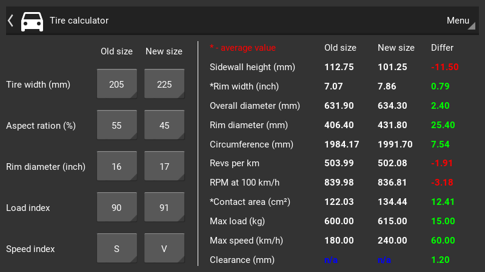

# Tire calculator
Application for calculating parameters of car tires

## Requirements
- Python >= 3.6
- Kivy >= 1.10
- [Widgets KV](https://github.com/Paduct/widgets_kv)

## Installation
```shell
git clone https://github.com/Paduct/tire_calculator
```

## Usage
### with GUI
```shell
python tire_calculator
```
### from TUI
```shell
python tire_calculator/src/calculator.py
```
```
usage: calculator.py [-h] [-c]

optional arguments:
  -h, --help  show this help message and exit
  -c          turn color design

Tire size input template (without quotes): '255/40 R17 94Y'
```

## Screenshot

